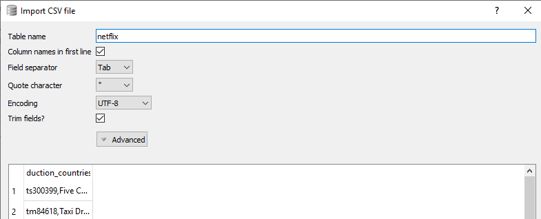
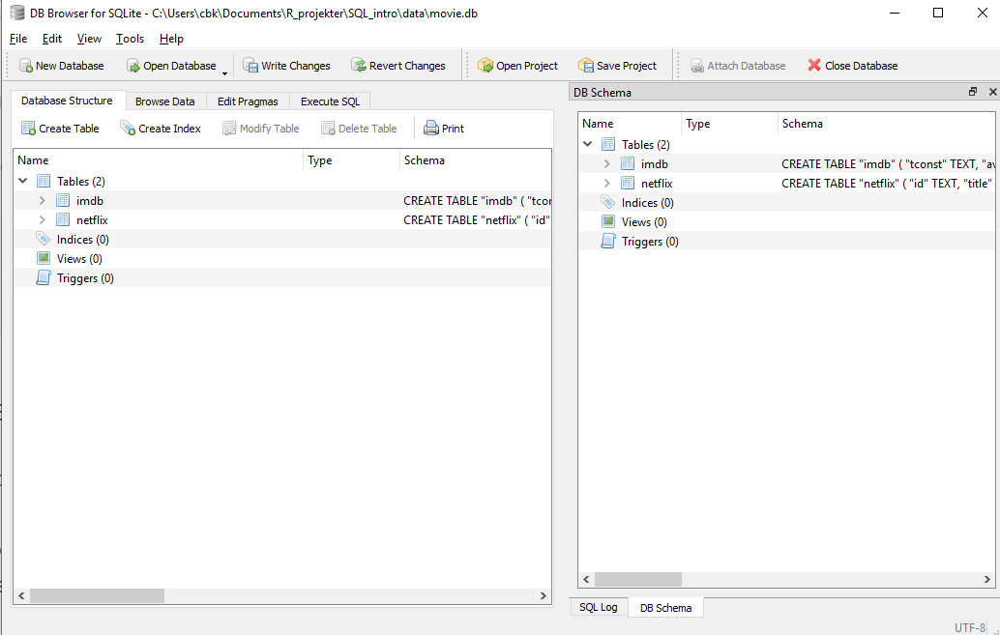
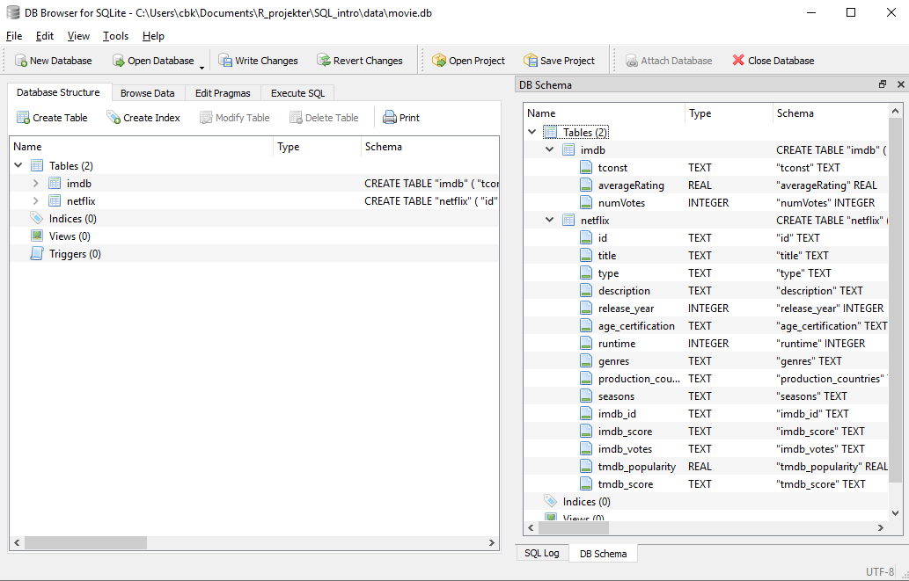

## What is SQL?

SQL is the abbreviation of "Structured Query Language", a domain specific computer
language, designed for managing data in relational database systems.

tip
Hvordan udtales det? Enten SQL eller 

SQL contains many types of statements, broadly grouped into four sublanguages

* A data query language - for retrieving data from a database
* a data definition language - for creating or modifying the structure of a database
* a data control langauge - for controlling access to data in a database
* a data manipulation language - for inserting, deleting and modifying data in the database

In this course, we are only focusing on SQL as a data query language.

## What is a relational database?

A relational database is a way to store and manipulate informaition. Databases
are arranged as tables. Each table has columns (also known as fields) that describe
the data, and rows (also known as records) which contain the data.

The relational part of the name refers to the fact that we are not storing 
every piece of information about a given entity in a single table, but rather
giving an entity an identifyer, a key, that is common for several tables.

DET HER MÅ KUNNE FORKLARES BEDRE.

When we are using a spreadsheet, we put formulas into cells to calculate new 
values based on old ones. When we are using a database, we send commands 
(usually called queries) to a database manager: a program that manipulates the 
database for us. The database manager does whatever lookups and calculations the 
query specifies, returning the results in a tabular form that we can then use as 
a starting point for further queries.

## When are we using databases?

Primarily because it is fast, even with very large amounts of data, and because 
it allows us to work with very large amounts of data.

The example data sets we are working with in this course are too large to 
handle in Excel, which is limited to 1,048,576 rows.

The, rather simple, database manager we are working with here has a theoretical 
maximum number of rows that is 2^64 (18,446,744,073,709,551,616).

However the maximum size of a database is 281 terabytes, limiting the actual
maximum number of rows to about 20,000,000,000,000.

Another reason to learn SQL is that the concepts used in quering a database
are central to understanding how to do similiar things in programming languages
as R or Python, as well as in interacting with online databases, APIs and 
search engines.

tip
## Why are we working with SQL
Also, in XXXX Britta Nielsen took a course in SQL. This aided her in.

Remember, with great power, comes great responsibility!

## Getting ready!

When you followed the instructions in setup LINK TIL, you downloaded and installed
DB Browser for SQLite. This will be our database management system.

You also downloaded two datasets.

Now we need to get those datasets into DB Browser for SQLite.

begin by opening DB Browser for SQLite

Click on "New Database" under "File" and save it under the name "movies" in a place
where you can find it again.

DB Browser would now like you to create a new table. Instead we would like to
import the data we downloaded. Click "Cancel"

Under "File" we find the option "Import", and choose "Table from CSV". We 
then choose the "netflix" file.

The data is not necessarily understood correctly by db browser, as illustrated 
below.

The data is read as "tab-separated" data. Change the value in "Field separator"
to "," and click "OK".

We have now imported the netflix data.

Repeat the process with the imdb.tsv file. You may have to change "Text files(*.csv *.txt)"
to "All files"

db browser will remember that you want "," as the field separator. In this
case we actually want the "Tab". Change it, and click "OK".

We now have both tables imported:

Look at the panel "DB Schema"

We can unfold the two tables to get a view of the structure:

The imdb table has three fields. tconst, averageRating and numVotes. 

tconst uniquely identifies the movie.

The netflix table has a lot of fields. id uniquely identifies the movie, but
not in the same way as the imdb table does.

However, the imdb_id is the same as tconst from the imbd table.

This is the center of the relational part of a relational database. There is a 
unique key in both the tables, that we can use to match the records in the two tables.

We are going to take advantage of this!

imdb as downloaded on october 17th 2022

https://www.kaggle.com/datasets/victorsoeiro/netflix-tv-shows-and-movies?select=titles.csv
https://www.imdb.com/interfaces/

der er noget med om film der er det ene sted men ikke det andet får højere eller lavere ratings end dem der er begge steder.

## What is the relation between relational databases and SQL?



