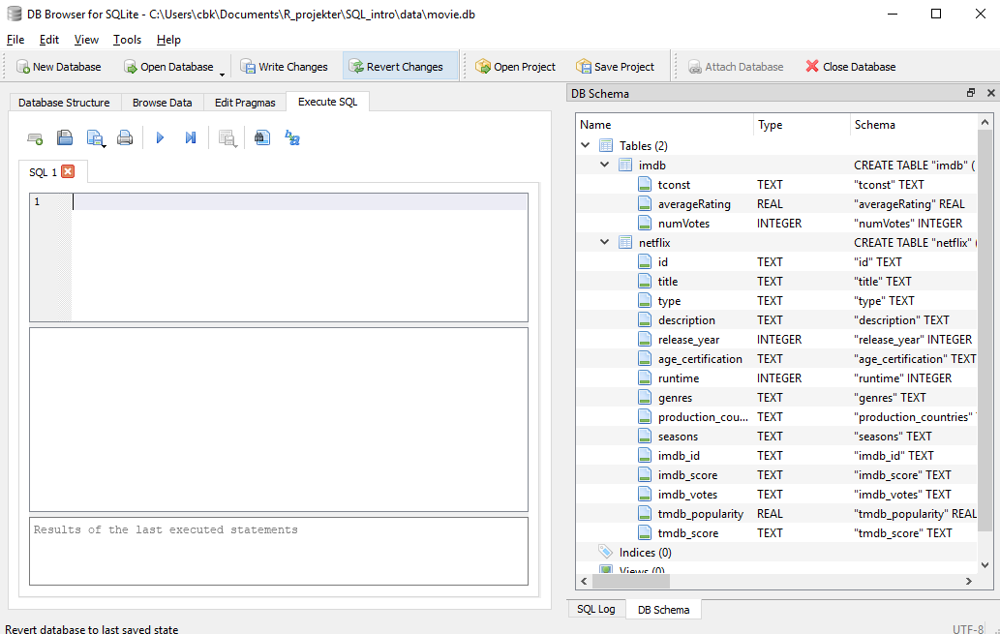

## What is a query?

A query is a request, for data. As an example "What is the average rating of 
movies on IMDB for movies that are listed on Netflix vs the average rating of movies
on IMDB that are not listed on Netflix?"

When we send a query to a database, we do so by using a 
common language called Structured Query Language, SQL for short. The standard, 
official way to pronounce SQL is by spelling out the letters. Many people
pronounce it "sequel". The latter tends to be used by database pros. Use whatever
you feel most comfortable with.

## My very first query

Begin by opening DB Browser for SQLite, and our example database (see Setup).
Choose "Browse Data", and the netflix table. This
table contains columns or fields. In this case:
id, title, type, description, release_year, age_certification, runtime, genres,
production_country, seasons, imdb_id, imdb_score, imdb_votes, tmdb_popularity and
tmdb_score.

OVERVEJ OM IKKE EG. imdb_* SKAL FJERNES FRA VORES EKSEMPEL DATA.

Queries are entered in the tab "Execute SQL":

The most simple SQL query we can do, selects a column from a table:

    SELECT title
    FROM netflix;

Note that we end our query with a semicolon, ;.

We enter the query, and press ctrl+Enter to execute the query, and we are rewarded
with the result:
 
 
 

Congratulations, you have now executed your first SQL query!

## Capitalization and good style

In the query above, we capitalized the words SELECT and FROM. We did that 
because they are SQL keywords. The SQL interpreter does not care, the query
would return the exact same results if we had written everything in lower case
letters.

However, it is considered good style to write out the SQL keywords in upper case
letters. It makes it easier to read and pick out exactly what is happening in
the query. Understanding SQL is difficult enough as it is, so if we can make life
a little easier for ourself and others by capitalizing the keywords, that is a
good idea.

If we want more information from our database than just the titles, we
can add a new column to the list of fields after SELECT, like this:

    SELECT title , release_year, imdb_id
    FROM netflix;

If we want everything, the wildcard * can be used:

    SELECT *
    FROM netflix;

Try that!

## Unique values

Sometimes we only want unique records returned. Even if we only have unique
records in our database, we will probably get duplicated records if we only 
select some fields.

We get the unique records if we add the SQL keyword DISTINCT after the 
SELECT. That will eliminate duplicated records, and only return unique results:

    SELECT DISTINCT title
    FROM netflix;
    
If we select more than one column, we will get the unique or distinct combinations
of the values in those columns:

    SELECT DISTINCT title, release_year
    FROM netflix;

## Sorting

If we want to sort the results of our query, we use the keyword ORDER BY.
This is a query that sorts the netflix table in ascencing order by release_year 
using the ASC keyword together with ORDER BY:

    SELECT title
    FROM netflix 
    ORDER BY release_year ASC;
    
The keyword ASC specifies that the results should be sorted in ascending order. 
If we want to sort in descending order, we could use the keyword DESC:

    SELECT title
    FROM netflix
    ORDER BY release_year DESC;

Note that we get the correct order, even if we do not see the actual release year.
If we want the year as well, we have to specify that in the SELECT part of our
query, like this:

    SELECT title, release_year
    FROM netflix
    ORDER BY release_year DESC;

Also note that the default sorting is ascending.

It is possible to sort by more than one column at once, even in different directions:

    SELECT title, release_year, imdb_score
    FROM netflix
    ORDER BY release_year ASC, imdb_score DESC;

Here we sort first by release_year in ascending order, and then by imdb_score in
descending order.

## A challenge!

REWRITE TO MATCH EXAMPLE DATA!
> ## Challenge
>
> Write a `CREATE VIEW` query that `JOINS` the `articles` table with the 
> `journals` table on `ISSNs` and returns the `COUNT` of article records 
> grouped by the `Journal_Title` in `DESC` order. 
>
> > ## Solution
> > ~~~
> > CREATE VIEW journal_counts AS
> > SELECT journals.Journal_Title, COUNT(*)
> > FROM articles
> > JOIN journals
> > ON articles.ISSNs = journals.ISSNs
> > GROUP BY Journal_Title
> > ORDER BY COUNT(*) DESC
> > ~~~
> > {: .sql}
> {: .solution}
{: .challenge}


